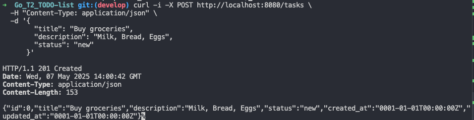
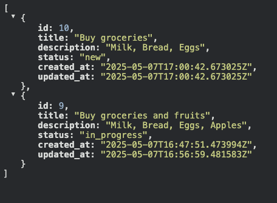
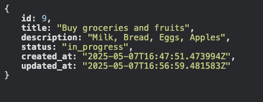
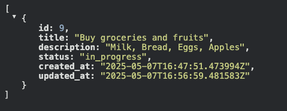
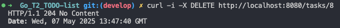
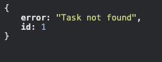

# TODO List REST API

Простое REST API для управления задачами, реализованное на Go с использованием Fiber и PostgreSQL

## 📌 Технологический стек

- **Язык**: Go 1.21+
- **Фреймворк**: Fiber v3
- **База данных**: PostgreSQL (драйвер pgx)
- **Миграции**: Нативные SQL-миграции

## 🚀 Быстрый старт

### Предварительные требования

- Установленный Go (версия 1.21+)
- Работающий PostgreSQL сервер

### Установка

#### 1. Клонировать репозиторий:

```bash
git clone https://github.com/yourusername/todo-api.git
cd todo-api
```

#### 2. Установить зависимости:

```bash
go mod download
```

#### 3. Настроить подключение к БД (файл ini.env):

```ini
DB_HOST=localhost
DB_PORT=5432
DB_USER=postgres
DB_PASSWORD=yourpassword
DB_NAME=todo_db
```

#### 4. Если нет БД с именем todo_db - создать и применить миграции:

```bash
psql -U postgres -d todo_db -a -f migrations/000001_create_tasks_table.up.sql
```

#### 5. Запустить сервер:

```bash
go run cmd/main.go
```

## 📚 API Документация

### Модель задачи

```json
{
	"id": 1,
	"title": "Task title",
	"description": "Task description",
	"status": "new",
	"created_at": "2023-10-20T12:00:00Z",
	"updated_at": "2023-10-20T12:00:00Z"
}
```

### Доступные статусы задач

new - Новая задача

in_progress - В процессе выполнения

done - Завершена

### Эндпоинты

POST /tasks Создать новую задачу
GET /tasks Получить список всех задач
GET /tasks/:id Получить задачу по ID
PUT /tasks/:id Обновить задачу
DELETE /tasks/:id Удалить задачу

## 🛠 Примеры запросов

✅ POST /tasks – создание задачи.

```bash
curl -X POST -H "Content-Type: application/json" -d '{
  "title": "Buy groceries",
  "description": "Milk, eggs, bread",
  "status": "new"
}' http://localhost:3000/tasks
```



✅ GET /tasks – получение списка всех задач.

```bash
curl http://localhost:3000/tasks
```



✅ GET /tasks/:id – получение задачи.



✅ PUT /tasks/:id – обновление задачи.



✅ DELETE /tasks/:id – удаление задачи



✅ Корректная обработка ошибок



## Тестирование

В репозитории доступен файл test_curl.bash с набором тестовых запросов.

## Структура БД

```
Таблица tasks с полями:
id SERIAL PRIMARY KEY
title TEXT NOT NULL
description TEXT
status TEXT CHECK (status IN ('new', 'in_progress', 'done')) DEFAULT 'new'
created_at TIMESTAMP DEFAULT now()
updated_at TIMESTAMP DEFAULT now()

```

## 🏗 Структура проекта

```

├── Go_test_todo.pdf
├── README.md
├── cmd
│ └── main.go
├── go.mod
├── go.sum
├── ini.env # Конфигурационные переменные
├── internal
│ ├── config # Конфигурация
│ │ └── config.go
│ ├── handlers # HTTP-обработчики
│ │ └── handlers.go
│ ├── models # Сущности и DTO
│ │ └── models.go
│ └── storage # Работа с БД
│ ├── postgres.go
│ └── storage.go
├── migrations # SQL-миграции
│ ├── 000001_create_tasks_table.down.sql
│ └── 000001_create_tasks_table.up.sql
└── test_curl.bash # Тестовые curl

```

```

```
